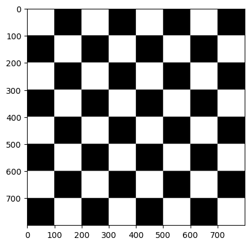
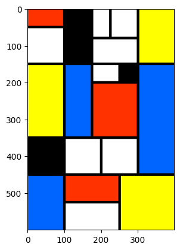
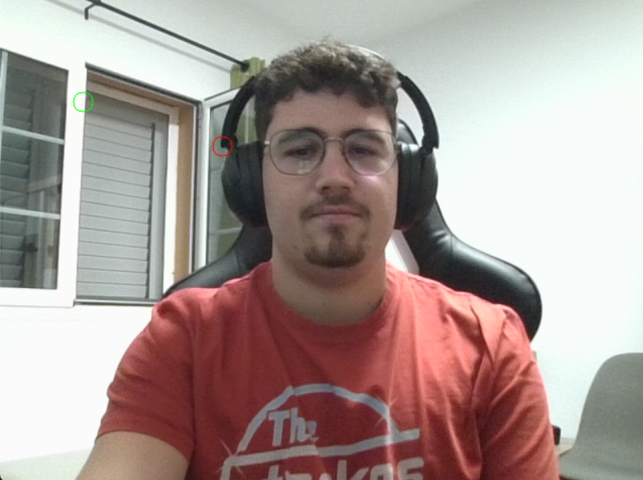
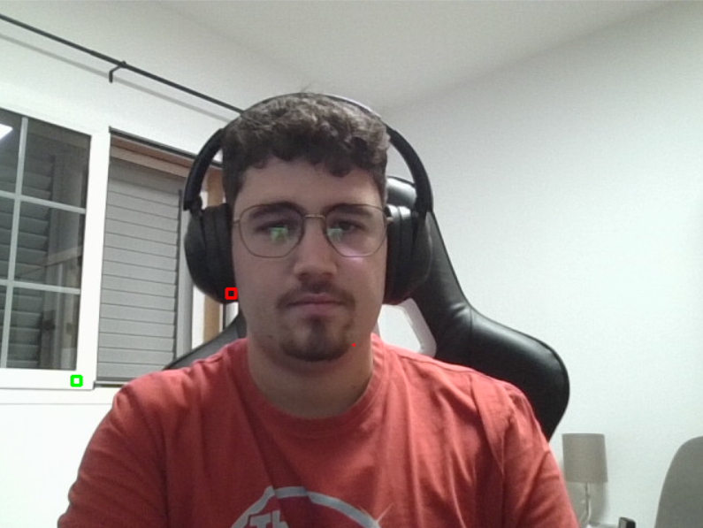
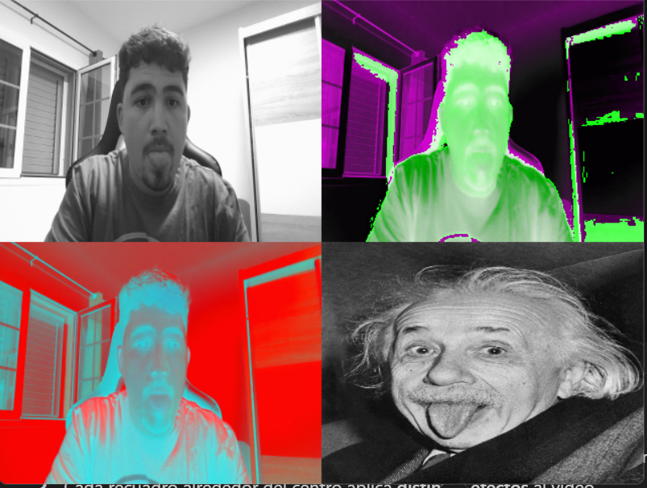

# Práctica 1 - Procesamiento de imágenes y vídeo con OpenCV

El objetivo de esta práctica es aprender de manera práctica a crear imágenes, manipular píxeles, dibujar formas y trabajar con vídeo en tiempo real utilizando OpenCV y NumPy. Al finalizar, somos capaces de generar patrones, modificar planos de color, detectar zonas más claras y oscuras y aplicar efectos creativos tipo pop art.

## Autor
[](https://github.com/carlosfc02)

---

## TAREA 1: Crear un tablero de ajedrez 800x800 píxeles

- **Paso 1:** Crear una imagen en negro de tamaño 800x800 con 1 canal (escala de grises).  
- **Paso 2:** Generar un patrón de ajedrez rellenando cuadros de 100x100 píxeles en blanco de manera alterna.  
- **Paso 3:** Mostrar la imagen usando `matplotlib`.  

<div align="center">
    
</div>

---

## TAREA 2: Crear una imagen estilo Mondrian usando OpenCV

- **Paso 1:** Crear una imagen blanca de 600x400 píxeles.  
- **Paso 2:** Dibujar líneas negras horizontales y verticales para formar la cuadrícula.  
- **Paso 3:** Rellenar rectángulos con colores distintos para crear el estilo Mondrian.  
- **Paso 4:** Mostrar la imagen usando `matplotlib`.  

<div align="center">
    
</div>

---

## TAREA 3: Modificar un plano de color de la cámara

- **Paso 1:** Capturar vídeo en tiempo real desde la webcam.  
- **Paso 2:** Separar los canales RGB y modificar un fragmento del canal rojo.  
- **Paso 3:** Concatenar horizontalmente los tres planos para formar un collage.  
- **Paso 4:** Mostrar el resultado en una ventana de OpenCV.  
- **Paso 5:** Finalizar al pulsar ESC.  

<div align="center">
    
</div>

---

## TAREA 4: Pintar círculos en los píxeles más claros y oscuros

- **Paso 1:** Capturar vídeo en tiempo real.  
- **Paso 2:** Convertir cada cuadro a escala de grises.  
- **Paso 3:** Detectar los píxeles más claros y oscuros con `cv2.minMaxLoc`.  
- **Paso 4:** Pintar círculos sobre estos píxeles en el cuadro original.  
- **Paso 5:** Mostrar el resultado en una ventana.  

<div align="center">
    
</div>

---

## TAREA 5: Pintar rectángulos sobre la zona 8x8 más clara y oscura

- **Paso 1:** Capturar vídeo y convertir cada cuadro a escala de grises.  
- **Paso 2:** Aplicar un filtro de media de 8x8 para detectar bloques más claros y oscuros.  
- **Paso 3:** Dibujar rectángulos sobre estos bloques en el cuadro original.  
- **Paso 4:** Mostrar el resultado en una ventana.  

<div align="center">
    
</div>

---

## TAREA 6: Propuesta propia de Pop Art

- **Paso 1:** Capturar vídeo a la mitad de resolución.  
- **Paso 2:** Crear un collage 2x2 donde cada recuadro aplica distintos efectos de color.  
- **Paso 3:** Insertar una imagen estática en uno de los recuadros.  
- **Paso 4:** Mostrar el resultado en tiempo real en una ventana de OpenCV.  
- **Paso 5:** Finalizar al pulsar ESC.  

<div align="center">
    
</div>

---

## Instrucciones de ejecución

1. Clonar el repositorio:
```bash
git clone https://github.com/carlosfc02/VC_P1.git
